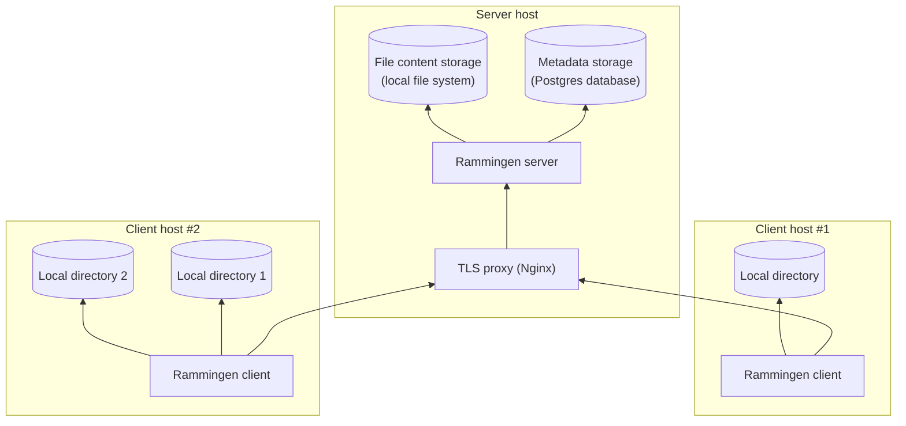

# Rammingen

Rammingen is a self-hosted file synchronization and backup system.

Rammingen client periodically runs in background, scans local files and uploads any new detected changes to your server. It also pulls changes from the server and applies them to the local files.

## Features

1. Rammingen server can work with multiple clients. The client supports Linux, Windows and osX.
1. Fully configurable path management: you can specify multiple local directories for periodic sync and map each of them to a virtual archive path that is shared among all clients. The same virtual archive path can be mapped to different local paths in different clients.
1. Flexible file ignore rules (name- or path-based, exact name match or regex, can be configured separately for each directory).
1. Non-automatic download and upload using `rammingen` cli for one-time operations.
1. End-to-end encryption: file contents and all metadata (including path names) are sent to the server in an encrypted form using a private key that never leaves your local systems. It uses AES-CMAC-SIV in AEAD mode with 512-bit key size.
1. Files with the same content (or renamed/moved files) will be deduplicated, i.e. the content will only be uploaded and downloaded once.
1. All files are compressed using DEFLATE.
1. Every version of each file is stored independently. You can use `rammingen` command to see all versions of a certain file or all changes within a certain directory. You can also download a specific version of a file or even a version of a directory at a particular time, serving essentially as a time machine.
1. Old versions of files are periodically cleaned up, leaving only the last version. You can configure the time interval after which that happens.
1. Rammingen runs in background and doesn't require any user intervention. It can show desktop notifications in case of errors or periodic notifications about file sync statistics (the interval of notifications can be configured).
1. Rammingen never modifies file names or content. In case of conflicted changes for a file, it overwrites the file with the latest version. However, you can always see all the versions and reset the file to the correct version.
1. It's optimized for slow networks and slow servers. You can run the server on the cheapest VDS configuration.
1. It's also optimized for large amounts of files. It can handle millions of files without issues.

## Setup



In order to use rammingen, you will need a server with a Postgres database and some space in the filesystem for storage. You also need to set up a rammingen client on your local system.

### Server setup

This guide assumes using Linux on the server. However, rammingen-server should also work on other systems.

1. Install Nginx, Postgres and Docker from system repository (e.g. using `apt`).
1. Set up a Postgres user and database.
1. Create a local directory for storage.
1. Create a server configuration file. You may store it in the custom directory or use default path:

    - Linux: `/etc/rammingen-server.conf`
    - macOS: `$HOME/Library/Application Support/rammingen-server.conf`
    - Windows: `%APPDATA%\rammingen-server.conf`

    The format of this config is specified in the [template](etc/rammingen-server.template.conf).
    You can use [JSON5 syntax](https://json5.org/).

1. Restrict access to Postgres password:

    ```sh
    chmod 600 rammingen-server.conf
    ```

1. Initialize the database and user credentials with rammingen-admin:

    ```sh
    docker run --volume /etc/rammingen-server.conf:/etc/rammingen-server.conf:ro \
        --entrypoint /sbin/rammingen-admin riateche/rammingen add-source main
    ```

    — new backup source will be called `main`. You'll receive an access token for the Rammingen client.

1. Run the server:

    ```sh
    docker run --volume /etc/rammingen-server.conf:/etc/rammingen-server.conf:ro \
        --volume "$HOME/backup-storage/:/app/backup-storage/" \
        riateche/rammingen
    ```

1. Set up Nginx.

    1. Generate private key and certificate:

        ```sh
        openssl req -newkey rsa:4096 -subj /CN=. -days 3660 -x509 -nodes \
            -keyout selfsigned.key -out selfsigned.crt
        ```

    1. Generate Diffie-Hellman group:

        ```sh
        openssl dhparam -out dhparam.pem 4096
        ```

        This command may take about 15 minutes to complete.

    1. Write a config for Nginx, you can use the [template](etc/proxy/).

    1. Run Nginx:

        ```sh
        docker run --volume ./etc/proxy/:/etc/nginx/conf.d/:ro \
            --volume selfsigned.key:/etc/ssl/private/selfsigned.key:ro \
            --volume selfsigned.crt:/etc/ssl/certs/selfsigned.crt:ro \
            --volume dhparam.pem:/etc/nginx/dhparam.pem:ro \
            --expose 8009:8009 \
            nginx:1.27.1
        ```

### Client host

1. Decide which local directory you would like to backup.
1. Create an encryption key:

    ```sh
    docker run --entrypoint /sbin/rammingen riateche/rammingen generate-encryption-key
    ```

1. Create client configuration file, you can use the [template](etc/rammingen.template.conf).
1. Upload a backup using the Rammingen client.

    ```sh
    docker run --volume "$HOME/Desktop/:/root/source/" \
        --volume /etc/rammingen.conf:/etc/rammingen.conf:ro \
        --entrypoint /sbin/rammingen riateche/rammingen --config /etc/rammingen.conf sync
    ```
## Caveats

Note that rammingen doesn't perform diffing and partial uploads of files - if a file is changed, the full file will be uploaded and stored.
