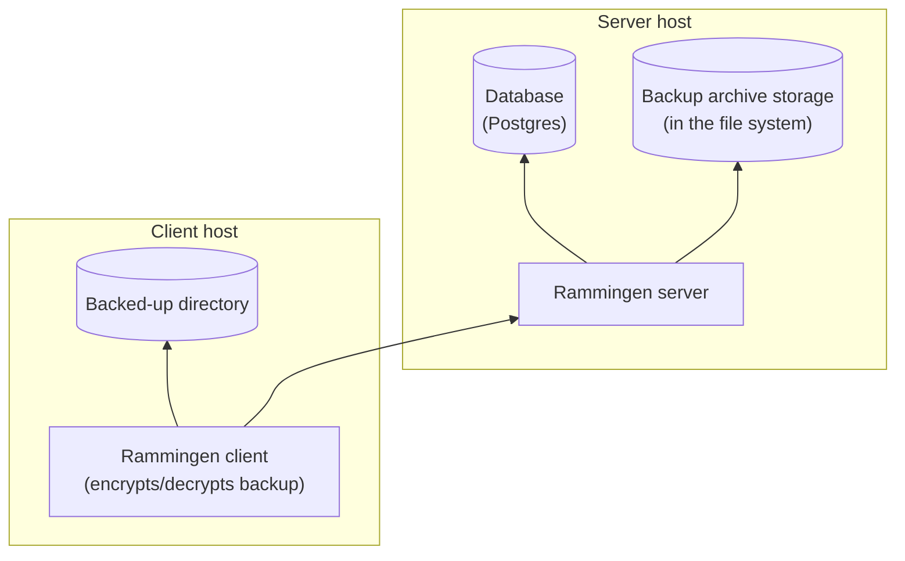

# Rammingen

Rammingen is a self-hosted backup encryption system.

1. Syncs backed-up directories across several hosts.
1. Manages previous versions of backups.

Rammingen installation dependency graph (arrows represent the "X depends on Y" relationship):



## Quick start

This guide will help you quickly deploy and try out Rammingen on your local machine.

1.  Start Rammingen server and its database:

    ```sh
    docker-compose --env-file ./etc/.env --file ./etc/docker-compose.yml up
    ```

    Note that the `etc/.env` file specifies DB password which isn't suitable for production.
    Be sure to replace it if you're deploying a production setup.

    Rammingen will provide credentials for the client in the log:

    1. **Access token** — "Successfully added new source. New access token:"
    1. **Encryption key** — "New encryption key:"

1.  Upload a backup using the Rammingen client.

    Use the following command to back up the `~/Desktop` directory to the server.
    Don't forget to specify your access token and encryption key:

    ```sh
    docker run -v "$HOME/Desktop/:/root/source/:ro" -e "TOKEN=" -e "KEY=" -e PORT=8007 \
        -v ./etc/config.template.json:/etc/config.template.json:ro --entrypoint sh \
        --network rammingen_default riateche/rammingen -c \
        "envsubst < /etc/config.template.json > /etc/rammingen.conf && \
        /sbin/rammingen --config /etc/rammingen.conf sync"
    ```
