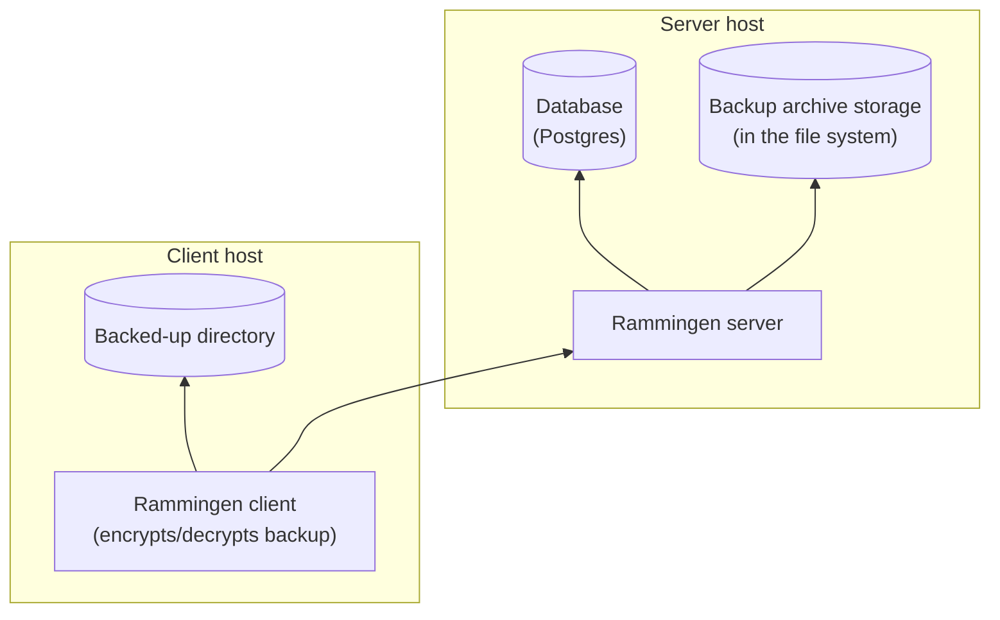

# Rammingen

Rammingen is a self-hosted backup encryption system.

1. Syncs backed-up directories across several hosts.
1. Manages previous versions of backups.

Rammingen installation dependency graph (arrows represent the "X depends on Y" relationship):

