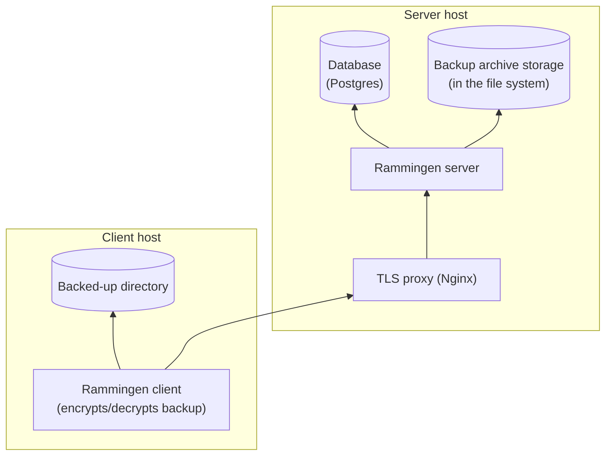

# Rammingen

Rammingen is a self-hosted file synchronization and backup system.

1. Manages previous versions of backups.
1. Stores the backup archive in encrypted form.

Rammingen installation dependency graph (arrows represent the "X depends on Y" relationship):



## Quick start

This guide will help you quickly deploy and try out Rammingen.

### Server host

1. Install Nginx, Postgres and Docker from system repository.
1. Set up a Postgres user and database.
1. Create a storage directory for backup archive.
1. Create server configuration file. You may store it in the custom directory or use default path:

    - Linux: `/etc/rammingen-server.conf`
    - macOS: `$HOME/Library/Application Support/rammingen-server.conf`
    - Windows: `%APPDATA%\rammingen-server.conf`

    The format of this config is specified in the [template](etc/rammingen-server.template.conf).
    You can use [JSON5 syntax](https://json5.org/).

1. Restrict access to Postgres password:

    ```sh
    chmod 600 rammingen-server.conf
    ```

1. Initialize the database and user credentials with rammingen-admin:

    ```sh
    docker run --volume /etc/rammingen-server.conf:/etc/rammingen-server.conf:ro \
        --entrypoint /sbin/rammingen-admin riateche/rammingen add-source main
    ```

    — new backup source will be called `main`. You'll receive an access token for the Rammingen client.

1. Run the server:

    ```sh
    docker run --volume /etc/rammingen-server.conf:/etc/rammingen-server.conf:ro \
        --volume "$HOME/backup-storage/:/app/backup-storage/" \
        riateche/rammingen
    ```

1. Set up Nginx.

    1. Generate private key and certificate:

        ```sh
        openssl req -newkey rsa:4096 -subj /CN=. -days 3660 -x509 -nodes \
            -keyout selfsigned.key -out selfsigned.crt
        ```

    1. Generate Diffie-Hellman group:

        ```sh
        openssl dhparam -out dhparam.pem 4096
        ```

        This command may take about 15 minutes to complete.

    1. Write a config for Nginx, you can use the [template](etc/proxy/).

    1. Run Nginx:

        ```sh
        docker run --volume ./etc/proxy/:/etc/nginx/conf.d/:ro \
            --volume selfsigned.key:/etc/ssl/private/selfsigned.key:ro \
            --volume selfsigned.crt:/etc/ssl/certs/selfsigned.crt:ro \
            --volume dhparam.pem:/etc/nginx/dhparam.pem:ro \
            --expose 8009:8009 \
            nginx:1.27.1
        ```

### Client host

1. Decide which local directory you would like to backup.
1. Create an encryption key:

    ```sh
    docker run --entrypoint /sbin/rammingen riateche/rammingen generate-encryption-key
    ```

1. Create client configuration file, you can use the [template](etc/rammingen.template.conf).
1. Upload a backup using the Rammingen client.

    ```sh
    docker run --volume "$HOME/Desktop/:/root/source/" \
        --volume /etc/rammingen.conf:/etc/rammingen.conf:ro \
        --entrypoint /sbin/rammingen riateche/rammingen --config /etc/rammingen.conf sync
    ```
