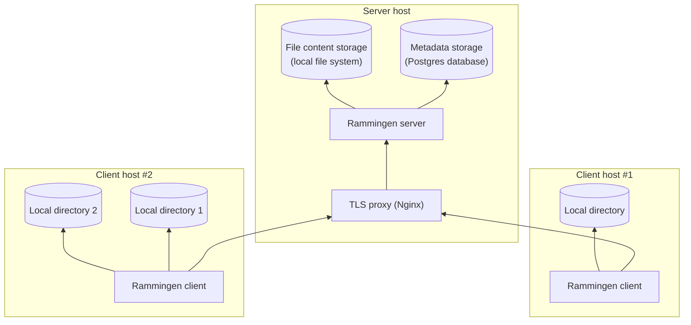

# Rammingen

**Rammingen** is a self-hosted file synchronization and backup system.

The rammingen client runs periodically in background, scanning local files and uploading any file changes to your server. It also pulls updates from the server and applies them locally, keeping your files in sync.

Supported platforms: **Windows, Linux, macOS, Android**.

## Features

1. **Cross-platform syncing:** A single Rammingen server can work with multiple clients running simultaneously on any supported system. All files are placed in a unified virtual file tree, where files and directories can be referenced by *archive path*.
1. **Fully configurable path management:** Configure multiple local directories for periodic sync and map each of them to an archive path. Each client can have its own independent mapping configuration.
1. **Powerful ignore rules:** Exclude files by name or path using exact matches or regex, with rules configurable globally or per directory.
1. **Extensive command line interface:**
    1. Upload and download files and directories on demand.
    2. Show the history of changes for any file or directory.
    3. Restore a file or directory to an earlier version.
    4. Move or delete archived files remotely.
1. **End-to-end encryption:** File contents and most metadata (including path names) are encrypted client-side using a private key that never leaves your devices. Rammingen uses AES-CMAC-SIV in AEAD mode with a 512-bit key.
1. **Content deduplication:** Identical file contents are stored only once, reducing storage and transfer overhead and improving sync performance when files are moved or renamed.
1. **Compression:** All files are compressed using DEFLATE.
1. **Full version history:** Each version of every file is stored independently. Browse all versions of a file or all historical changes in a directory. Download any specific version of a file or even the entire directory state at a chosen point in time.
1. **Automatic cleanup:** Old versions are periodically pruned while retaining snapshots at configured intervals. The default policy keeps all versions for two weeks and weekly snapshots for older data.
1. **Unattended operation:** Rammingen runs in the background and requires no user intervention. It can show desktop notifications for errors or periodic sync statistics, with configurable intervals.
1. **No unexpected file changes:** Rammingen never modifies file names or contents. It does not create duplicate files during conflicts; instead, the most recent version is applied while all historical versions remain available for recovery.
1. **Optimized for slow networks and modest servers:** The server can run smoothly even on the cheapest VDS/VPS plans.
1. **Performant on millions of files:** Designed with git repositories and large codebases in mind, Rammingen handles large amounts of files efficiently.
1. **Rigorously tested:** A fuzz test simulates real-world user behavior (editing files, syncing, uploading, downloading, and more) across multiple devices to ensure synchronization is correct every time.

## Setup


```mermaid
graph BT
    subgraph Server host
        server[Rammingen server]
        db[("Metadata storage<br>(Postgres database)")]
        storage[("File content storage<br>(local file system)")]
        tls_proxy["TLS proxy (Nginx)"]
    end

    subgraph Client host #1
        client1["Rammingen client"]
        directory1[(Local directory)]
    end

    subgraph Client host #2
        client2["Rammingen client"]
        directory2[(Local directory 1)]
        directory22[(Local directory 2)]
    end

    server --> db
    server --> storage
    client1 --> tls_proxy
    client1 --> directory1
    client2 --> tls_proxy
    client2 --> directory2
    client2 --> directory22
    tls_proxy --> server
```

In order to use Rammingen, you will need a server with a Postgres database and some space in the filesystem for storage. You also need to set up a Rammingen client on your local system.

### Server setup

This guide assumes using Linux on the server. However, rammingen-server should also work on other systems.

1. Install Nginx, Postgres and Docker from system repository (e.g. using `apt`).
1. Set up a Postgres user and database.
1. Create a local directory for storage.
1. Create a server configuration file. You may store it in the custom directory or use default path:

    - Linux: `/etc/rammingen-server.conf`
    - macOS: `$HOME/Library/Application Support/rammingen-server.conf`
    - Windows: `%APPDATA%\rammingen-server.conf`

    The format of this config is specified in the [template](etc/rammingen-server.template.conf).
    You can use [JSON5 syntax](https://json5.org/).

1. Restrict access to Postgres password:

    ```sh
    chmod 600 rammingen-server.conf
    ```

1. Initialize the database and user credentials with rammingen-admin:

    ```sh
    docker run --volume /etc/rammingen-server.conf:/etc/rammingen-server.conf:ro \
        --entrypoint /sbin/rammingen-admin riateche/rammingen add-source main
    ```

    — new backup source will be called `main`. You'll receive an access token for the Rammingen client.

1. Run the server:

    ```sh
    docker run --volume /etc/rammingen-server.conf:/etc/rammingen-server.conf:ro \
        --volume "$HOME/backup-storage/:/app/backup-storage/" \
        riateche/rammingen
    ```

1. Set up Nginx.

    1. Generate private key and certificate:

        ```sh
        openssl req -newkey rsa:4096 -subj /CN=. -days 3660 -x509 -nodes \
            -keyout selfsigned.key -out selfsigned.crt
        ```

    1. Generate Diffie-Hellman group:

        ```sh
        openssl dhparam -out dhparam.pem 4096
        ```

        This command may take about 15 minutes to complete.

    1. Write a config for Nginx, you can use the [template](etc/proxy/).

    1. Run Nginx:

        ```sh
        docker run --volume ./etc/proxy/:/etc/nginx/conf.d/:ro \
            --volume selfsigned.key:/etc/ssl/private/selfsigned.key:ro \
            --volume selfsigned.crt:/etc/ssl/certs/selfsigned.crt:ro \
            --volume dhparam.pem:/etc/nginx/dhparam.pem:ro \
            --expose 8009:8009 \
            nginx:1.27.1
        ```

### Client host

1. Decide which local directory you would like to backup.
1. Create an encryption key:

    ```sh
    docker run --entrypoint /sbin/rammingen riateche/rammingen generate-encryption-key
    ```

1. Create client configuration file, you can use the [template](etc/rammingen.template.conf).
1. Upload a backup using the Rammingen client.

    ```sh
    docker run --volume "$HOME/Desktop/:/root/source/" \
        --volume /etc/rammingen.conf:/etc/rammingen.conf:ro \
        --entrypoint /sbin/rammingen riateche/rammingen --config /etc/rammingen.conf sync
    ```
## Caveats

- Rammingen doesn't perform diffing and partial uploads of files - if a file is changed, that entire file will be uploaded and stored, unless it's exactly the same as a file uploaded earlier.
- There is no conflict resolution. If you make conflicting changes to the same files at two devices simultaneously, the more recent change will overwrite the older one. Both versions will be available for manual selection though.
- Rammingen is not a full backup solution. When setting up the server, you are expected to set up backups for the database and the file storage that it uses.
